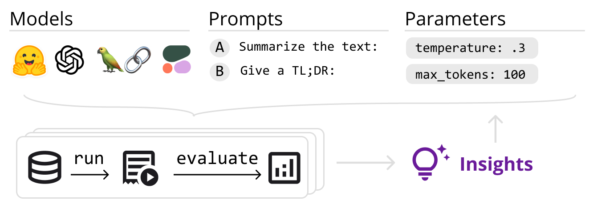

# Zeno Build

[Zeno Build](https://github.com/zeno-ml/zeno-build) is a tool for developers
who want to quickly build, compare, and iterate on applications using large
language models.

Zeno Build allows you to:

1. **Easily prototype** LLM-based applications through a unified wrapper
   interface over open-source and API-based models.
2. **Specify the space of experiments** you want to to run.
3. **Run experiments** to train and evaluate these models, including:
   1. **Hyperparameter optimization** to find the best hyperparameters for your
      task.
   2. **Evaluation of outputs** using state-of-the-art model-based metrics for
      evaluation of generated text.
4. **Explore the results** of these experiments, using a comprehensive visual
    report that allows you to slice-and-dice data and uncover insights that
    can feed back to better model, data, and prompt engineering.

In order to demonstrate how each of the above features work, we have a number
of [examples](../examples/) of how you can use `zeno-build` for different tasks.

Read on for more details:

* [Implementing Models](implementing_models.md)
* [Specifying Experimental Parameters](specifying_parameters.md)
* [Running Experiments](running_experiments.md)
* [Exploring Results](exploring_results.md)
