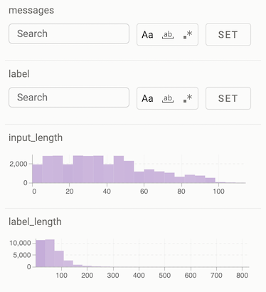
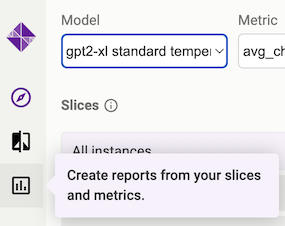
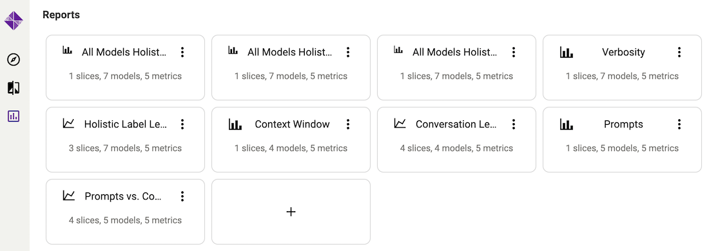
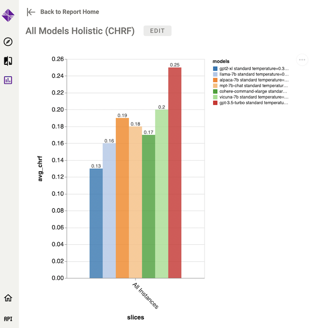
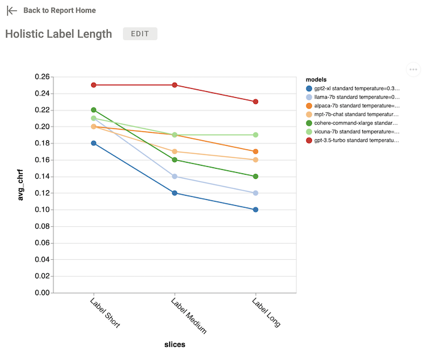
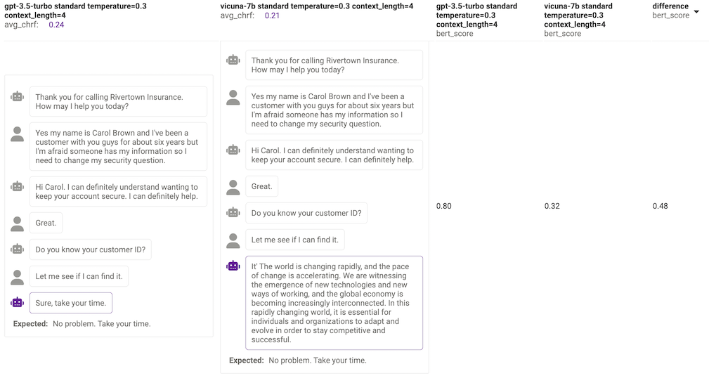

# Exploring Results

Once you have finished [running experiments](running_experiments.md), you can
explore the results of your experiments using the Zeno that will appear
(usually at the link [http://localhost:8000](http://localhost:8000)).

We'll provide a demonstration of how you can do this using our
[chatbot report example](https://zeno-ml-chatbot-report.hf.space).

## Data and Model Output Exploration

The first thing that you can do is explore the outputs. When you first open
the interface you will see a page like this.

On the left you have an interface that allows you to view model statistics and
easily select subsets of data. On the right you have a table that shows the
data that you have selected.

First, you can decide which model you want to look at by selecting it from
the dropdown menu at the top of the page.

To select a subset of data, you can browse down the left side and see features
that look a bit like this:

If you want to filter down your data to only include examples that have a
particular value for a feature:

* **Textual Features**: Type in a value in the text box and click "set". You
  can also use regexes or adjust case-sensitivity by pressing the buttons.
* **Numerical Features**: Dragging the slider to select a range of values.
* **Categorical Features**: Clicking on a specific value in the bar chart
  (not displayed above).

For instance, if we want to find all examples that have a length of 100 or
fewer characters that contain the string "sorry", you can filter the
"label and "label_length" features, and see that the displayed examples
on the right are updated.

Once you've found a subset of the data that you're interested in, you can
save it for future analysis and monitoring by clicking the "Create
a new Slice" button:

You can also arrange slices into folders for easier browsing.

This slicing is very powerful functionality if you get creative with
the features and patterns that you use! If you want to try to add new
features, you can implement them and add them to the `config.py` file
in the examples that you're using, some examples below:

* [Features for Chatbots](https://github.com/zeno-ml/zeno-build/blob/6ab05c7083ef556aa12a626c0771814c74f030aa/examples/chatbot/config.py#L187-L201)
* [Features for Translation](https://github.com/zeno-ml/zeno-build/blob/6ab05c7083ef556aa12a626c0771814c74f030aa/examples/analysis_gpt_mt/config.py#L117-L134)

## Report Building

Once you have some models to compare and some slices to compare them on,
you can start building reports. To do this, click on the "Reports" button
on the left of the page:

This will take you to a page that shows all of your created reports.

There are many different ways of creating reports, but two of the most
common ones are

1. Comparing models holistically across all data:

2. Comparing models across different slices across a single metric. Below
   is an example of comparing different models across different lengths
   of the expected chat output:

You can click on the "edit" button to go in and make edits to the various
report parameters.

## Qualitative Comparison

One final handy feature of Zeno is the ability to compare the outputs of
two models on the same examples. You can do this by clicking on the
qualitative comparison button:

On the page, you can then select the two models you want to compare side-by-side,
and select the metric you'd like to compare them by. Here we choose `gpt-3.5-turbo`
and `vicuna` and compare them according to the `bert_score` metric.

You can also sort the outputs by the difference between the scores between the two
systems by clicking on the header of the "difference" column. This allows you to
find examples where one of the two systems produces much better outputs than the
other, such as the one below where one model suddenly went off track
and produced an incomprehensible output.

## Next Steps

If you've explored your data and found anything interesting, we'd love
to have you share it with us! See the [contributing](../CONTRIBUTING.md)
page for more details.
