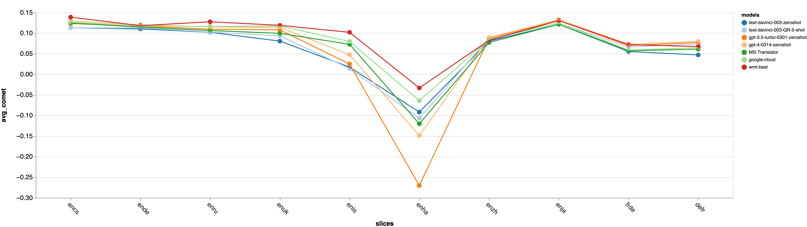
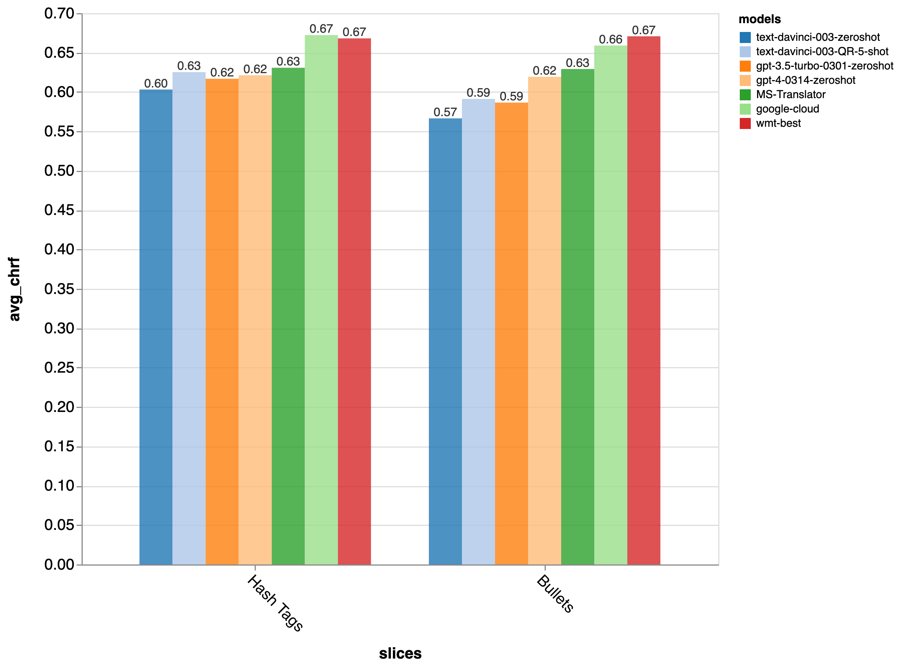

# Zeno GPT-MT Report

by [Graham Neubig](http://phontron.com/) (June 9, 2023)

Machine translation is one of the most important and classic language-related
tasks, and a huge investment has been put into it over the years. Due to this
fact, we now have great products like [Google
Translate](https://translate.google.com/), [Bing
Translator](https://www.bing.com/translator), and
[DeepL](https://www.deepl.com/en/translator) that are created specifically for
this task. On the other hand, recently general-purpose language models such as
[ChatGPT](https://chat.openai.com/) have been released as general-purpose tools
that can handle many different tasks.

**So can we now use the GPT models to handle our translation tasks? Or should we
*still be using special-purpose translation models?**

Luckily, some good folks at Microsoft [ran an extensive set of
experiments](https://github.com/microsoft/gpt-MT), generating different results
from GPT and comparing them against existing methods. The [Microsoft
paper](https://arxiv.org/abs/2302.09210) is a great paper (read it!) but I was
eager to dig in a bit more and understand the peculiarities of how GPT models
stand up to practical usage in multilingual applications. So we used
[Zeno](https://zenoml.com/) to explore the data, and found:

- **GPT-3.5 is competitive but still somewhat worse** than the other MT models
  that were tried, and this is relatively consistent across languages
- GPT models are competitive on shorter sentences, but **worse on
  longer sentences**
- GPT-3.5 demonstrates some **rare but degenerate behavior** such as repeating
  or dropping content, or performing particularly poorly on unusually formatted
  text
- On the other hand, GPT models did **better on some more tricky examples**,
  such as idioms, ambiguous expressions, or pronouns - We also compared pricing,
  **gpt-3.5-turbo is less expensive, text-davinci-003 is comparable, and gpt-4
  is more expensive than special-purpose translation APIs** such as Google’s or
  Microsoft’s

We released a browsing interface here so that you can easily dig in deeper too:

- **[Browse the results here](https://zeno-ml-gpt-mt-report.hf.space)**

Read on for more!

## Experimental Settings

The experiments introduce seven different main systems:

- Zero-shot GPT-3.5 (**text-davinci-003-zeroshot**): GPT-3.5 using no examples.
- Few-shot GPT with random examples (**text-davinci-003-RR-1-shot** and
  **text-davinci-003-RR-5-shot**): This uses 1 or 5 random examples from a
  training corpus as demonstrations to the GPT model.
- Few-shot GPT with quality
  examples (**text-davinci-003-QR-1-shot** and **text-davinci-003-QR-5-shot**):
  This uses 1 or 5 examples that are selected for their high degree of alignment
  between the inputs and outputs.

These are compared with both Microsoft Translator (**MS-Translator**) and the
best-performing systems from the [Conference on Machine
Translation](http://www2.statmt.org/wmt23/) (**wmt-best**).

As evaluation data, the paper uses the standard MT data from WMT. This is news
data, mostly between English and Czech (cs), Russian (ru), Ukranian (uk),
Icelandic (is), German (de), Chinese (zh), Japanese (ja), and Hausa (ha).

For analyzing the data, I mostly used
**[chrF](https://aclanthology.org/W15-3049/)**, a simple measure of
character-level overlap between the system output and a human-authored
gold-standard reference translation. But the browsing interface also shows
results for
[BERTScore](https://docs.inspiredco.ai/critique/metric_bert_score.html) and
[COMET](https://docs.inspiredco.ai/critique/metric_comet.html), model-based
metrics that also tend to have good correlation with human judgements.

Let’s take a look at the findings!

## Overall Performance Comparison

Overall, the GPT-based models did quite well given that they are not
specifically trained for translation. Averaged over all datasets, the results
did lag a little bit behind MS translator and the best WMT system, but they were
still quite competitive. Here are the results for chrf, BERTScore, and COMET:

| chrf | BERTScore | COMET |
| --- | --- | --- |
|  |  |  |

Next, let’s look language-by-language. I’ve separated these into translations
into English and into other languages:

### Into English

### Into Other Languages

Overall, we can see that GPT-3 tends to be more competitive with the other
state-of-the-art models when translating into English than when translating out
of English or between French and German.

### Accuracy by Length

One other interesting note is that the difference between special purpose models
is larger for long sentences (more than 100 characters) than it is for shorter
sentences (less than or equal to 40 characters). So it may be more important to
use special-purpose models if translating longer text such as news or documents,
and the GPT models may be sufficient for shorter texts such as conversations.

## GPT-3.5 is Less Robust than Special-purpose Models

While overall accuracy was good, digging deeper into the data demonstrated some
interesting and concerning cases that hint that the GPT models may be less
robust in settings where they are pushed a bit.

These examples were found by searching for examples that were relatively
low-scoring and then using Zeno’s [exploration
UI](https://zenoml.com/docs/intro#exploration-ui) to measure the occurrence of
different issues. Specifically, we found several issues with degenerate outputs:

- Too-short outputs with a low length ratio
- Too-long outputs with a high length ratio
- Repeated words

We also found that the GPT models tended to underperform on slightly unusual
sentences with many capital letters in the input, and those with special
formatting.

### Too-short Outputs

As noted in the figure above, Zero-shot GPT was prone to output very short
outputs (where we counted “very short” as less than 30% of the length of the
human reference translation). These were usually indicative of the model
outputting the name of the target language as-is without outputting any of the
translated content:

Notably, there is a simple fix for this: few-shot prompting effectively
prevented extremely short outputs, so when using the GPT models for translation
it seems necessary to provide a few demonstrations.

### Too-long Outputs/Repeated Words

All of the GPT models, both using zero-shot and few-shot prompting, were more
prone than the other special-purpose systems to output very long outputs (which
we defined as 200% of the length of the human reference). These were often, but
not always indicative of repeated words:

So we also measured the number outputs where the same word was repeated more
than 100 times (displayed in the figure above). Notably, this was an issue for
all of the GPT-based models, but never happened for the Microsoft or WMT
systems, so this is clearly an area where the special-purpose systems were
superior.

If you want to use GPT in translation applications, adjusting the
`frequency_penalty`
[parameter](https://platform.openai.com/docs/api-reference/parameter-details) to
help suppress these repetitive outputs may be prudent.

### Capitalized Inputs

Zero- and one-shot GPT was particularly bad at processing sentences with lots of
capital characters (more than 20%).

This is because it tended to not appropriately capitalize the output (results
for zero-shot).

However, after using 5-shot prompting, this issue was resolved somewhat
(although not completely).

### Sensitivity to markup

Overall, GPT was not very good at maintaining punctuation/formatting. For
instance, it did poorly when the sentences included tags such as `#TAG_NAME#` or
started with a bullet point such as `*` or `-`:

It also had trouble with translations when the word “EDIT” was presented in
upper-case. It refused to translate EDIT, and sometimes output something
completely different than the original input (this is 1-shot).

## Where do the GPT models shine?

While in the previous examples we focused on places where the GPT models
underperformed, there were definitely some places where they seemed to do a bit
better. Here are just a few qualitative examples from Japanese, a language that
I understand well.

**Idiomatic Expressions:** There were quite a few examples where GPT did better
at translating idiomatic expressions. This one has GPT translate correctly as
“retaliation” where MS-Translator translates it as “eight that hit”.

**Ambiguous Expressions:** Similarly to idiomatic expressions, GPT did quite
well on ambiguous expressions that could be interpreted different ways. In this
example, GPT gets the correct translation “tear”, whereas MS translates into
“shake”.

**Pronouns:** Japanese is a [pro-drop
language](https://en.wikipedia.org/wiki/Pro-drop_language), which means that
you don’t always need to include pronouns in sentences (so “I ran” could be
said just as “ran”). GPT tended to resolve this ambiguity relatively well, here
is an example.

## Practicalities: Cost

All of the previous discussion is based on the accuracy of the outputs, but when
deciding whether to use a particular translation API, it’s also worth discussing
the cost. In the below table, we summarize the cost of some popular APIs. Within
the GPT series, gpt-3.5-turbo is significantly cheaper, text-davinci-003 is
approximately the same, and gpt-4 is significantly more expensive than
special-purpose translation APIs such as Google and Microsoft. All of these are
3-4 orders of magnitude less expensive than human translation.

| Model | Cost / 1M Characters | Notes |
| --- | --- | --- |
| gpt-3.5-turbo | $0.8 | Pricing is $2 / 1M Tokens, so this assumes about 2.5 characters per token |
| text-davinci-003 | $8 | Pricing is $20 / 1M Tokens, so this assumes about 2.5 characters per token |
| Google Translate | $10 |
| Microsoft Translator | $10 |
| gpt-4 | $18 | Pricing is $30 / 1M per encoded token, $60 / 1M per decoded token with an 8k context window, and this takes the average
| DeepL | $25 |
| Human Translation | $20,000 | A standard cost for human translation is $0.1 per word, and there are about 5 characters in a word |

[Translation API Pricing](https://www.notion.so/04b7b19eb96b4de1a32b94e03f3c49ce?pvs=21)

## Conclusions

From these results, we can come to the conclusion that the GPT series is a
pretty competitive choice for translation, but as of GPT-3.5 not quite up to the
standards of state-of-the-art translation-specific models. In particular, it
seems to underperform when translating into non-English languages, and also
seems to be less robust, showing significantly more degenerate behavior.

You can click around **[the browsing
interface](https://zeno-ml-gpt-mt-report.hf.space)** and explore more! If you
speak any of the languages that were evaluated, you can also click on the
appropriate “language pair” bar and view only outputs from that language as
well.

One notable omission from the GPT-MT dataset is that while there were
experiments with ChatGPT (which was slightly worse numerically than GPT-3.5),
the experiments were run before the GPT-4 API was released. GPT-4 is [allegedly
better at multilingual tasks](https://openai.com/research/gpt-4), so it would be
very interesting to see the results with that. If you would be interested in
helping with this, please reach out via our [github
issue](https://github.com/zeno-ml/zeno-build/issues/128) and we could add it to
the report!
