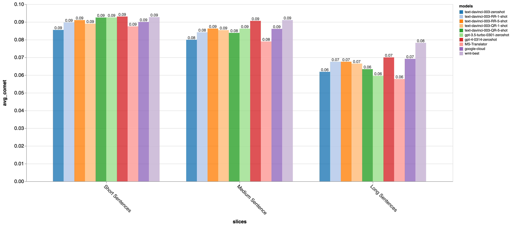
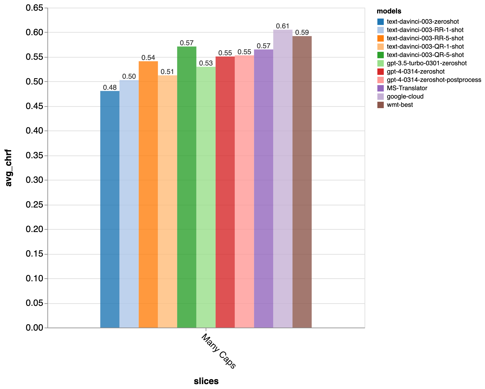

# Zeno GPT-MT Report

by [Graham Neubig](http://phontron.com/) with contributions from
[Zhiwei He](https://zwhe99.github.io/).

(Updated June 22, 2023)

Machine translation is one of the most important and classic language-related
tasks, and a huge investment has been put into it over the years. Due to this
fact, we now have great products like [Google
Translate](https://translate.google.com/), [Bing
Translator](https://www.bing.com/translator), and
[DeepL](https://www.deepl.com/en/translator) that are created specifically for
this task. On the other hand, recently general-purpose language models such as
[ChatGPT](https://chat.openai.com/) have been released as general-purpose tools
that can handle many different tasks.

**So can we now use the GPT models to handle our translation tasks? Or should we
*still be using special-purpose translation models?**

Luckily, some good folks at Microsoft [ran an extensive set of
experiments](https://github.com/microsoft/gpt-MT), generating different results
from GPT-3.5 and comparing them against existing methods. The [Microsoft
paper](https://arxiv.org/abs/2302.09210) is a great paper (read it!) but I was
eager to dig in a bit more and understand the peculiarities of how GPT models
stand up to practical usage in multilingual applications, and also interested
in how other models such as gpt-3.5-turbo (ChatGPT), GPT-4, and Google Translate
compared.

So we used [Zeno](https://zenoml.com/) to explore the data, and found:

- **GPT-3.5 is somewhat worse than the Microsoft and Google offerings,
  while GPT-4 is on par with them**.
- GPT models are **relatively good on shorter sentence and relatively bad on
  longer sentences**.
- GPT models demonstrates some **rare but degenerate behavior** such as repeating
  or dropping content, performing particularly poorly on unusually formatted
  text, and sometimes outputting extraneous information not included in the input.
- On the other hand, GPT models did **better on some more tricky examples**,
  such as idioms, ambiguous expressions, or pronouns
- We also compared pricing, **gpt-3.5-turbo is less expensive,
  but text-davinci-003 and gpt-4 are more expensive than
  special-purpose translation APIs** such as Google’s or Microsoft’s

We released a browsing interface here so that you can easily dig in deeper too:

- **[Browse the results here](https://zeno-ml-translation-report.hf.space)**

Read on for more!

## Experimental Settings

The experiments introduce seven different main systems:

- Zero-shot GPT-3.5 (**text-davinci-003-zeroshot**),
  ChatGPT (**gpt-3.5-turbo-0301-zeroshot**), and GPT-4 (**gpt-4-0314-zeroshot**):
  GPT models using no examples.
- Few-shot GPT with random examples (**text-davinci-003-RR-1-shot** and
  **text-davinci-003-RR-5-shot**): This uses 1 or 5 random examples from a
  training corpus as demonstrations to the GPT model.
- Few-shot GPT with quality
  examples (**text-davinci-003-QR-1-shot** and **text-davinci-003-QR-5-shot**):
  This uses 1 or 5 examples that are selected for their high degree of alignment
  between the inputs and outputs.

These are compared with both Microsoft Translator (**MS-Translator**),
Google Translate (**google-cloud**) and the
best-performing systems from the [Conference on Machine
Translation](http://www2.statmt.org/wmt23/) (**wmt-best**).

As evaluation data, the paper uses the standard MT data from WMT. This is news
data, mostly between English and Czech (cs), Russian (ru), Ukranian (uk),
Icelandic (is), German (de), Chinese (zh), Japanese (ja), and Hausa (ha).

For analyzing the data, we used three different metrics:

- **[chrF](https://docs.inspiredco.ai/critique/metric_chrf.html)**: a
  simple measure of character-level overlap between the system output and a human-authored
  gold-standard reference translation.
- **[COMET](https://docs.inspiredco.ai/critique/metric_comet.html)**: a
  metric based on a pretrained model that is fine-tuned to predict human
  judgements.

Both metrics are useful, but chrF tends to better capture stylistic similiarity
(e.g. it is very sensitive to capitalization, spelling, etc.), where COMET
tends to better capture whether the outputs are semantically correct.

Let’s take a look at the findings!

## Overall Performance Comparison

Overall, the GPT-based models did quite well given that they are not
specifically trained for translation. With respect to chrF, the special-purpose
models seem to do a bit better, but with respect to COMET, GPT-4 actually
bests the special-purpose models. Here are the detailed results:

| chrf | COMET |
| --- | --- |
|  |  |

This indicates that the GPT models are doing a good job of capturing the
semantics of the input, but are not as good at matching the style or exact wording
of the output. (I will explain the GPT-4 "postprocess" output below)

Next, let’s look language-by-language. I’ve separated these into translations
into English and into other languages, and displayed the COMET score:

### Into English

### Into Other Languages

Overall, we can see that the GPT series and particularly GPT-4 notches quite
impressive performance when translating **into** English, with the results
being particularly striking for language pairs with a high-resource source
language that is different from English (e.g. Chinese and Japanese). On the
other hand, translating **into other languages**, the GPT models are anywhere
from very similar to the special-purpose models (e.g. for German, French,
and Czech) to significantly worse (e.g. for Russian, Ukranian,
Icelandic, and Hausa).

### Accuracy by Length

One other interesting note is that the difference between special purpose models
is larger for long sentences (more than 100 characters) than it is for shorter
sentences (less than or equal to 40 characters). So it may be more important to
use special-purpose models if translating longer text such as news or documents,
and the GPT models may be sufficient for shorter texts such as conversations.

## GPT Series is Less Robust than Special-purpose Models

While overall accuracy was good, digging deeper into the data demonstrated some
interesting and concerning cases that hint that the GPT models may be less
robust in settings where they are pushed a bit.

These examples were found by searching for examples that were relatively
low-scoring and then using Zeno’s [exploration UI](/docs/exploring_results.md)
to measure the occurrence of different issues. Specifically, we found several
issues with degenerate outputs:

- Too-short outputs with a low length ratio
- Too-long outputs with a high length ratio
- Repeated words
- Outputting the name of the target language as-is

| Degenerate Outputs | Outputting the Target Language |
| --- | --- |
|  |  |

We also found that the GPT models tended to underperform on slightly unusual
sentences with many capital letters in the input, and those with special
formatting.

### Too-short Outputs and Outputting the Target Language

As noted in the figure above, Zero-shot GPT was prone to output very short
outputs (where we counted “very short” as less than 30% of the length of the
human reference translation). These were usually often indicative of the model
outputting the name of the target language as-is without outputting any of the
translated content:

It was also common for GPT-4 to output the name of the target language as
part of the translation, like this:

This was really common, 2,223 times as shown in the chart!
There are a couple of fixes for this.

1. For `text-davinci-003`, where we tried out few-shot prompting, this largely
   fixed the problem. Unfortunately though (as we discuss in detail below),
   using few-shot prompting also greatly increases cost of using the models.
2. Another simple alternative that we tried out was a post-processing rule that
   removed the name of the language from the beginning of the output sentence.
   This is the `gpt-4-postprocess` model in the chart above.
   This removed all of these degenerate examples, and increased the COMET score
   for GPT-4 by a whole 0.2% overall, closing half of the gap between it and the
   best WMT model.

### Too-long Outputs/Repeated Words

All of the GPT models, both using zero-shot and few-shot prompting, were more
prone than the other special-purpose systems to output very long outputs (which
we defined as 200% of the length of the human reference). These were often, but
not always indicative of repeated words:

So we also measured the number outputs where the same word was repeated more
than 100 times (displayed in the figure above). Notably, this was an issue for
the `text-davinci-003` models, but not the other systems.
This could be fixed by the
`frequency_penalty`
[parameter](https://platform.openai.com/docs/api-reference/parameter-details) to
help suppress these repetitive outputs may be prudent.

Interestingly, GPT-4 didn't output the same word multiple times, but it had other
crazy outputs that resulted in excess length, such as translating into Japanese
and then also into the phonetic spelling in English characters.
This is likely a result of the model being trained on language learning materials
that include phonetic spellings.

### Capitalized Inputs

Zero- and one-shot GPT were also less good at processing sentences with lots of
capital characters (more than 20%).

This is because it tended to not appropriately capitalize the output (results
for zero-shot).

However, after using 5-shot prompting, this issue was resolved somewhat
(although not completely).

### Sensitivity to markup

Overall, GPT was not very good at maintaining punctuation/formatting. For
instance, it did poorly when the sentences included tags such as `#TAG_NAME#` or
started with a bullet point such as `*` or `-`:

It also had trouble with translations when the word “EDIT” was presented in
upper-case. It refused to translate EDIT, and sometimes output something
completely different than the original input (this is 1-shot).

## Where do the GPT models shine?

While in the previous examples we focused on places where the GPT models
underperformed, there were definitely some places where they seemed to do a bit
better. Here are just a few qualitative examples from Japanese, a language that
I understand well.

**Idiomatic Expressions:** There were quite a few examples where GPT did better
at translating idiomatic expressions. This one has GPT translate correctly as
“retaliation” where MS-Translator translates it as “eight that hit”.

**Ambiguous Expressions:** Similarly to idiomatic expressions, GPT did quite
well on ambiguous expressions that could be interpreted different ways. In this
example, GPT gets the correct translation “tear”, whereas MS translates into
“shake”.

**Pronouns:** Japanese is a [pro-drop
language](https://en.wikipedia.org/wiki/Pro-drop_language), which means that
you don’t always need to include pronouns in sentences (so “I ran” could be
said just as “ran”). GPT tended to resolve this ambiguity relatively well, here
is an example.

## Practicalities: Cost

All of the previous discussion is based on the accuracy of the outputs, but when
deciding whether to use a particular translation API, it’s also worth discussing
the cost. In the below table, we provide an estimation of the cost of some
popular APIs for translation of 1M input characters.  We make a few simplifying
assumptions (where reality will vary based on the language pair and dataset):

- There are an identical number of characters in the input and output.
- There are about 2.5 characters per GPT token.
- There are about 5 characters per word.
- The length of a zero-shot prompt is about 50% that of the average input
  sentence.

For GPT we show the results when using 0-shot, 1-shot, and 5-shot prompts, as
used in the experiiments above.  `gpt-3.5-turbo` is pretty uniformly the
cheapest, followed by the Google and Microsoft APIs.  `text-davinci-003` and
`gpt-4` are more expensive, even when using 0-shot prompts and become an order
of magnitude more expensive when using 5-shot prompts.  Even the most expensive
model-based solution is 2 orders of magnitude less expensive than human
translation.

| Model                | 0-shot Cost | 1-shot Cost | 5-shot Cost | Notes |
| ---                  | ---         | ---         | ---         | ---   |
| gpt-3.5-turbo        | $1.5        | $2.7        | $7.5        | Pricing is $1.5 / 1M tokens (both input and output) |
| Google Translate     | $10         | -           | -           | Pricing is $10 / 1M input characters |
| Microsoft Translator | $10         | -           | -           | Pricing is $10 / 1M input characters |
| text-davinci-003     | $20         | $36         | $100        | Pricing is $20 / 1M tokens (both input and output) |
| DeepL                | $25         | -           | -           | Pricing is $10 / 1M input characters |
| gpt-4                | $42         | $78         | $222        | Pricing is $30 / 1M per encoded token, $60 / 1M per decoded token with an 8k context window, and this takes the average
| Human Translation    | $20,000 | A standard cost for human translation is $0.1 per word, and there are about 5 characters in a word |

We also added a [script](gpt_translation_pricing_calculator.py) to show our work
for the GPT model calculations.

## Conclusions

From these results, we can come to the conclusion that the GPT series is a
pretty competitive choice for translation. GPT-3.5 is not quite up to the
standards of state-of-the-art translation-specific models, but GPT-4 is quite
competitive. On the other hand, from a pricing perspective, Google and Microsoft
options are more cost-efficient.

You can click around **[the browsing
interface](https://zeno-ml-translation-report.hf.space)** and explore more! If you
speak any of the languages that were evaluated, you can also click on the
appropriate “language pair” bar and view only outputs from that language as
well.
