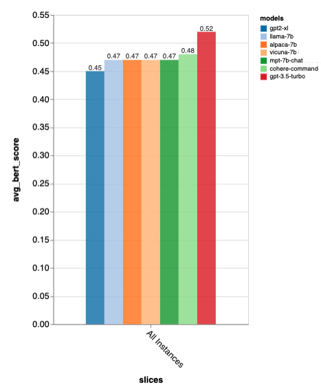
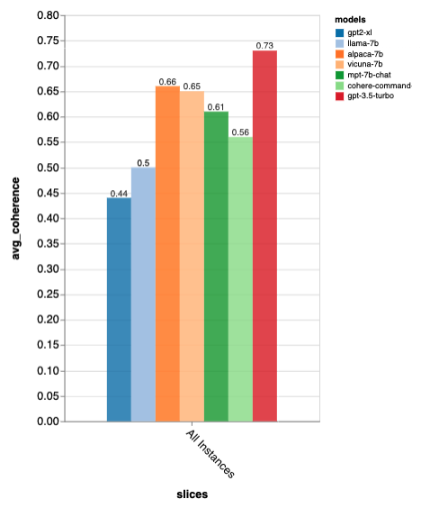
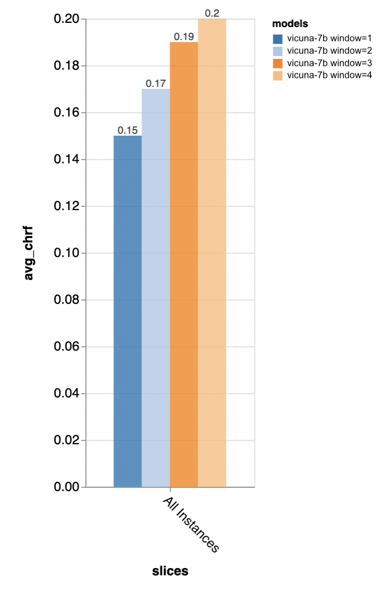
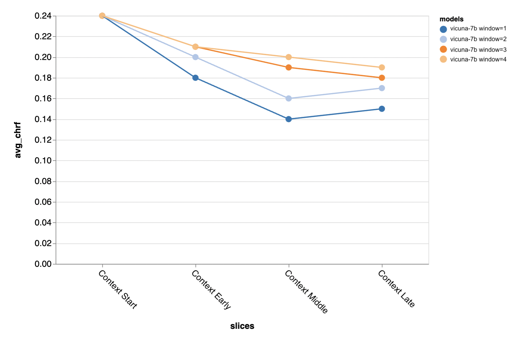
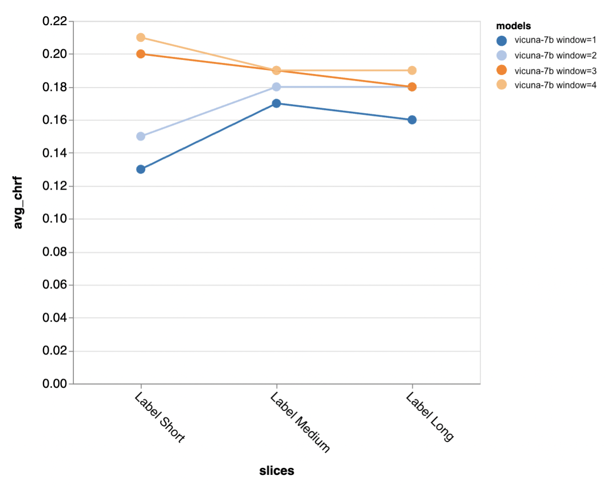
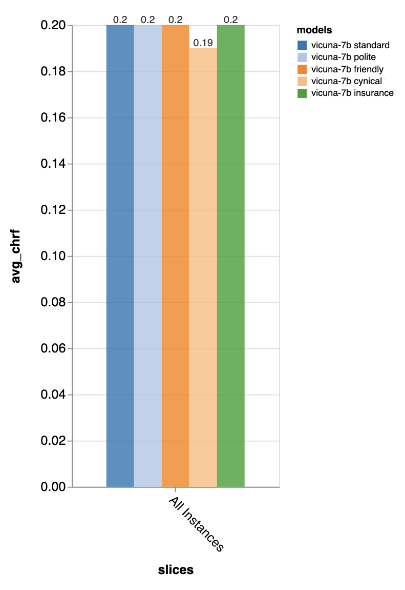
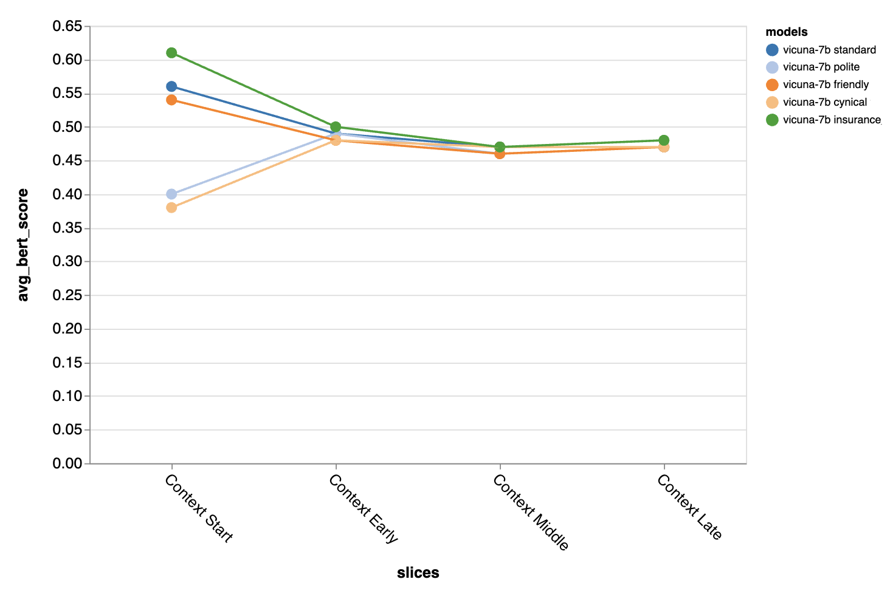

# Zeno Chatbot Report

by [Alex Cabrera](https://cabreraalex.com/) and
   [Graham Neubig](http://www.phontron.com/) (May 18, 2023)

## Overview

Large language models (LLMs) are taking the world by storm, and one big
application for them is chat, with applications in question answering, customer
service, and many others. However, chatbots are **notoriously hard to
evaluate**, and there still isn’t a clear sense about which of the recent models
are best to use in what situations.

In this report, we demonstrate some **first results on automatically evaluating
and comparing recent chatbots**, with the goal of making it easier for people to
understand the current lay-of-the-land with respect to all of the open-source
and API-based models coming out recently. In particular, we create a **new
open-source toolkit for evaluating LLMs,
[Zeno Build](https://github.com/zeno-ml/zeno-build)**. This combines together
(1) a unified interface to use open-source LLMs through Hugging Face or online
APIs, (2) **an online interface for browsing and analyzing** results using
[Zeno](https://zenoml.com/), and (3) **state-of-the art evaluation metrics**
for text using [Critique](https://docs.inspiredco.ai/critique/).

[Browse the results here](https://zeno-ml-chatbot-report.hf.space)

**Highlights:**

- We evaluated **7 language models**: GPT-2, LLaMa, Alpaca, Vicuna, MPT-Chat,
  Cohere Command, and ChatGPT (gpt-3.5-turbo)
- The models were evaluated on their ability to create human-like responses on a
  **customer service** dataset
- **ChatGPT came out on top**, but the open-source chat model **Vicuna was also
  very competitive**
- It is **important to use a chat-tuned model with a long context window**
- **Prompt engineering particularly improves performance for turns early in the
  conversation**, but less so later turns where more context is available
- Even for a strong model like ChatGPT, it is easy to find **obvious issues in
  hallucinations, failure to probe for more information, and repeated content**

Read on for more detail,
[try out Zeno Build](https://github.com/zeno-ml/zeno-build) if you want to play
around yourself, and we very much welcome additional contributions! To get in
touch, open an issue on the
[issues page](https://github.com/zeno-ml/zeno-build/issues), jump in the Zeno
[discord](https://discord.gg/km62pDKAkE), or get in contact via
[email](mailto:reports@zenoml.com).

## Setup

### Model Settings

We use the
[DSTC11 customer service dataset](https://github.com/amazon-science/dstc11-track2-intent-induction),
which includes agent-customer customer service interactions. We test 7 models:

- **[GPT-2](https://huggingface.co/gpt2):** A classic language model from 2019.
  We added this as a baseline to see how much the recent progress in language
  modeling has made a difference in building better chat models.
- **[LLaMa](https://huggingface.co/decapoda-research/llama-7b-hf):** A language
  model originally trained by Meta AI that uses a straight-up language modeling
  objective. We use the 7B model for this and all following open-source models.
- **[Alpaca](https://huggingface.co/chavinlo/alpaca-native):** A model based on
  LLaMa that additionally uses instruction tuning.
- **[Vicuna](https://huggingface.co/eachadea/vicuna-7b-1.1):** A model based on
  LLaMa that is further explicitly tuned for chatbot-based applications.
- **[MPT-Chat](https://huggingface.co/mosaicml/mpt-7b-chat):** A model trained
  from scratch in a way similar to Vicuna, which has a more commercially
  permissive license.
- **[Cohere Command](https://docs.cohere.com/docs/command-beta):** An API-based
  model by Cohere that is tuned for following commands.
- **[ChatGPT (gpt-3.5-turbo)](https://platform.openai.com/docs/models/gpt-3-5):**
  The standard-bearer of API-based chat models by OpenAI.

For all models by default we use a temperature of 0.3, context window of 4
previous chat turns, and a standard prompt saying “You are a chatbot tasked with
making small-talk with people.” (with other ablations below).

### Evaluation Metrics

We evaluated the models based on how similar their outputs are to human customer
service responses. This was done using metrics provided by the
[Critique](https://docs.inspiredco.ai/critique/) toolkit:

- **[chrf](https://docs.inspiredco.ai/critique/metric_chrf.html):** Measures the
  overlap of character strings
- **[BERTScore](https://docs.inspiredco.ai/critique/metric_bert_score.html):**
  Measures overlap of embeddings between the two utterances
- **[UniEval Coherence](https://docs.inspiredco.ai/critique/metric_uni_eval.html):**
  Predicts how coherent the outputs are with the previous chat turn

We also measured length ratio, which simply measures the length of the output
divided by the length of the gold-standard human response, indicating how
verbose the chatbot is.

### Further Analysis

To dig deeper into the results, we used the [Zeno](https://zenoml.com/) analysis
interface, specifically using its
[report generator](https://zenoml.com/docs/intro#report-ui) to subdivide the
examples based on the position in the conversation (start, early, middle, and
late) and the length of the gold-standard human response (short, medium, and
long), and its
[exploration interface](https://zenoml.com/docs/intro#exploration-ui) to look
through examples with bad automatic scores, and to better understand where each
of the models is failing.

We also did ablation studies on the Vicuna model, trying different context
windows and prompts in the analysis.

## Results

### How well do models perform overall?

According to all of these metrics, gpt-3.5-turbo was the clear winner. Vicuna
was the open-source Winner. GPT-2 and LLaMa were not very good, demonstrating
the importance of training directly on chat.

These rankings also approximately match those of the
[lmsys chat arena](https://chat.lmsys.org/), which uses human A/B testing to
compare models, but **Zeno Build’s results were obtained without any human
ratings.**

With regards to verbosity, gpt3.5-turbo is far more verbose than the others, and
it seems that models tuned for chat tend to be verbose in general.

### Accuracy by Gold-standard Response Length

Next, we used the [Zeno report UI](https://zenoml.com/docs/intro#report-ui) to
dig deeper. First, we measure accuracy separately by short (≤35 characters),
medium (36-70 characters), and long (≥71 characters) human responses.

gpt-3.5-turbo and Vicuna maintain accuracy even on longer chat turns while
others drop off.

#### How important is the context window?

We experimented using Vicuna with context windows ranging from 1-4 previous
utterances. As we increase the context window, the performance goes up,
indicating that larger context windows are important.

Longer context is particularly important in the middle and later parts of the
conversation, where responses are less templated and more dependent on what was
said previously.

More context is particularly important when trying to generate outputs where the
gold standard is shorter (possibly because there is more ambiguity).

### How important is the prompt?

We tried 5 different prompts - 4 generic ones and one specifically tailored to
the task of customer service chat in the insurance domain:

- **Standard:** “You are a chatbot tasked with making small-talk with people.”
- **Friendly:** “You are a kind and friendly chatbot tasked with making
  small-talk with people in a way that makes them feel pleasant.”
- **Polite:** “You are an exceedingly polite chatbot that speaks very formally
  and tries to not make any missteps in your responses.”
- **Cynical:** “You are a cynical chatbot that has a very dark view of the world
  and in general likes to point out any possible problems.”
- **Insurance:** “You are an agent at the Rivertown Insurance helpdesk that
  mainly helps with resolving insurance claims.”

Overall, the prompt didn’t make a very large measurable difference, but the
“cynical” chatbot was a little bit worse, and the tailored “insurance” chatbot
was a little bit better overall.

The differences were especially stark on the first turn of the conversation,
indicating that the prompt is most important when there is little other context
to work with.

## Discovered Errors (and possible mitigations)

Finally, we used Zeno’s
[exploration UI](https://zenoml.com/docs/intro#exploration-ui) to try to find
possible errors by gpt-3.5-turbo, the worst performing model. Specifically, we
looked at all examples that had low chrf (<0.1) and looked through them manually
to find trends.

### Hallucinations

Sometimes the model generates factually incorrect statements, particularly based
on providing false customer information or information about the company
policies. This would need to be solved by adding more information about the
customer into the prompt, or looking up company policies and referring to them
when answering specific questions.

### Failure to Probe

Sometimes the model fails to probe for more information when it’s actually
necessary, such as continuing listening for a number when the number is not yet
complete. This could possibly be mitigated by modifying the prompt to remind the
model of the required shape for certain pieces of information (e.g. a phone
number must be 10 digits).

### Repeated Content

Sometimes the same content is repeated multiple times, such as the bot saying
“thank you” twice here.

### Correct

Sometimes the response is reasonable, but just different than the human response.

## Final Words

We hope this report was helpful! If you want to try other models, other dataset,
other prompts, or other hyperparameter settings, jump over to the chatbot
example on the zeno-build repository to try it out. We’ll be happy to discuss
more and answer any questions via [email](mailto:reports@zenoml.com),
[discord](https://discord.gg/km62pDKAkE), or Github
[issues](https://github.com/zeno-ml/zeno-build/issues).
